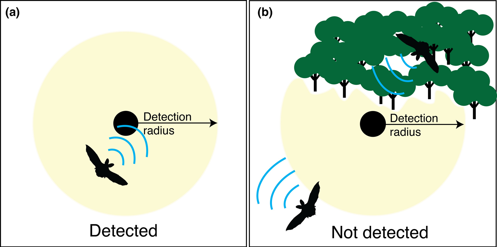
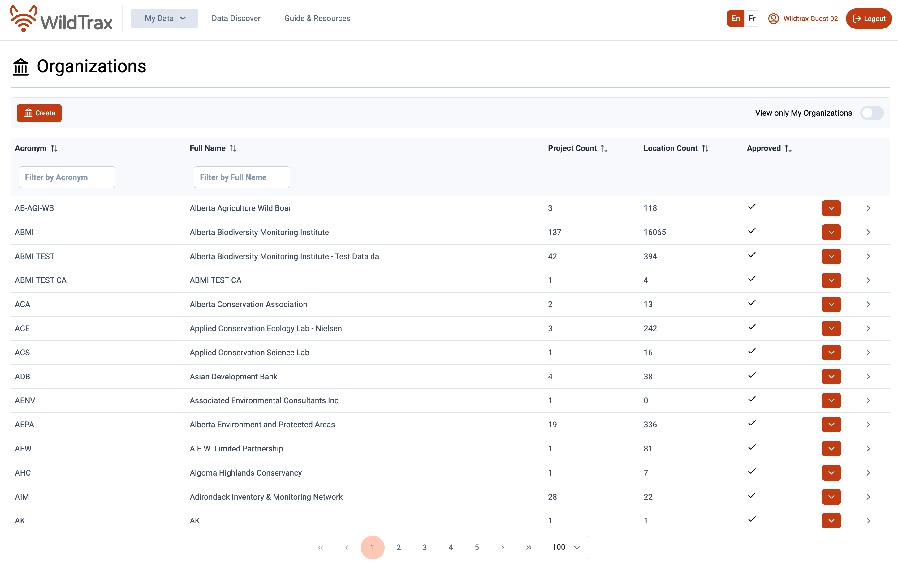
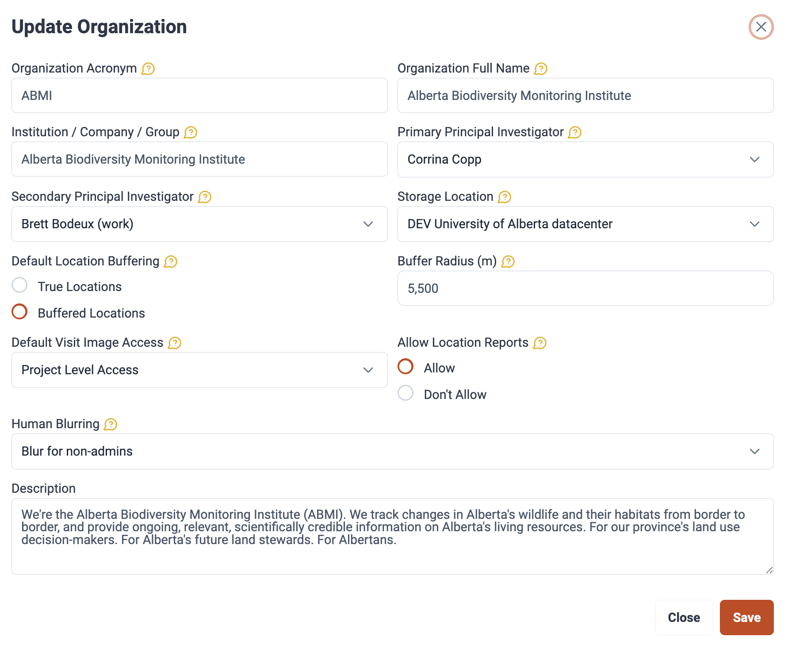

## Executive Summary


This pilot program is a collaboration between [Alinea International's ECCO-FARM project](https://ecco-farm.alineainternational.com/en/), [Biodiversity Pathways Ltd.](https://biodiversitypathways.ca/), [Khustai National Park](https://www.hustai.mn/language/en/), the [University of Alberta](https://www.ualberta.ca/en/index.html), the [University of Northern British Columbia](https://www.unbc.ca/) and [URECA](https://ureca.com/), to pilot the use of passive acoustic monitoring technology in Mongolia.

## Overview

This guide supports the use of the **Wildlife Acoustics Song Meter Mini 2 (SM Mini 2)** in Mongolia as part of a pilot program applying autonomous recording units (ARUs; @aru-overview) for biodiversity and soundscape monitoring. It is written for first-time users and walks through understanding the basic uses of the device, deploying it in the field, retrieving data, and managing recordings in [WildTrax](https://wildtrax.ca).

::: callout-note
## Pilot status

This is the first deployment cycle for this program. If a step in the field doesn't match what's described here, note it, so this guide can be enhanced and improved into the future.
:::

## Understand

An **autonomous recording unit (ARU)** is a passive recording device that captures the acoustic environment: bird calls, amphibian choruses, insect activity, wind, humans, and other ambient sound, without having a person present. ARUs are left unattended in the field on a fixed recording schedule, then retrieved later so the audio can be reviewed and analyzed for species presence and soundscape activity. Detections of sounds are determined by the environment and the detectability of the signal in question (@fig-aru-detection).

{#fig-aru-detection}

The SM Mini 2 is built for this kind of unattended deployment:

- **Weatherproof (IP67-rated) housing** that withstands rain, snow, dust, and temperature swings which makes it well-suited to Mongolia's exposed, variable field conditions.
- **Long battery life** on AA batteries, letting the unit run for weeks to months depending on the recording schedule chosen.
- **Bluetooth configuration** via the free Song Meter Configurator app (iOS/Android), so the unit can be set up and checked without opening the housing.
- **Preset recording schedules** covering common monitoring use cases (e.g., dawn chorus, continuous recording, hourly sampling), so a unit can be deployed without writing a custom schedule from scratch.

## Deploy

For this pilot, use the **default schedules provided in the Configurator app** rather than a custom schedule, this keeps setup consistent across all units and observers.

### Gear Checklist

For a single ARU unit you will need the equipment identified in @tbl-deployment-equipment.

```{r}
#| label: tbl-deployment-equipment
#| tbl-cap: "Equipment required for ARU deployment"
#| echo: false

library(knitr)
library(kableExtra)

equipment <- data.frame(
  Item = c(
    "Smartphone with GPS",
    "Standard data sheet",
    "Wildlife Acoustics Songmeter Configurator App",
    "4–8 AA alkaline batteries",
    "1 × Class 10 32 GB SD card",
    "Screws and screwdriver",
    "1–1.5 m stake or rebar",
    "Zip ties or a lock"
  ),
  Notes = c(
    "Used to log the exact coordinates of each deployment.",
    "One per deployment to record site information and metadata for later entry into WildTrax.",
    "Installed and paired via Bluetooth before heading out.",
    "More batteries allow longer runtime and more data collection.",
    "Formatted and ready before deployment.",
    "Used for mounting to a stake, post, or tree.",
    "Needed in open, treeless environments.",
    "Secures the housing against tampering or curious wildlife (fits a 0.25 in / 6 mm opening)."
  )
)

kable(
  equipment,
  format = "html",
  booktabs = TRUE
) |>
  kable_styling(
    bootstrap_options = c("striped", "hover", "condensed"),
    full_width = FALSE
  ) |>
  column_spec(1, bold = TRUE, width = "25%") |>
  column_spec(2, width = "65%")
```

### Pairing an ARU to the Configurator App

- Turn on the ARU and hold the pairing button until the flashing light appears, indicating pairing
- Ensure Bluetoooh is enabled on your phone, open the Songmeter Configurator app, eand scan to pair nearby ARUs. Select the ARU and connect

### Choose a schedule

Once you have paired the next step is to set a schedule. For this pilot, select **"Record birds/frogs for 5 minutes of every hour."** At this setting:

- The recorder has roughly **35 recording days** before the SD card fills up.
- The batteries should last approximately **5 months** in the field.

::: callout-tip
## Why this schedule

Five minutes per hour balances data volume against battery and data storage limits, while still sampling activity across the full diel cycle, which is useful for a first pilot where deployment length, species and retrieval logistics aren't yet fully known.
:::

### Site selection and mounting

**Open, treeless environment:**

- Mount the ARU on a wooden stake or metal rebar, driven at least **1/3 of its length** into the ground to keep it stable.
- Position the unit **0.5–1 m above the ground** — high enough to reduce wind interference with the microphones.
- Orient the microphones **against the direction of prevailing wind** to reduce wind noise in recordings.
- In areas where wildlife may disturb the unit, a metal security cage can be used.

**Treed environment:**

- Secure the unit to the trunk with screws or a locking security cable.
- Mount at **1.5 m height**, facing **north** — this is the standard orientation used across the pilot, making it easier to compare recordings and determine sound direction across sites.


### Finalize the deployment

1.  In the Configurator app, confirm the unit shows as **active/recording** on the selected schedule.
2.  Close and latch the housing lid securely.
3.  Disconnect / unpair from the Configurator app.
4.  Record the site ID, GPS coordinates, date/time, and any habitat notes on the data sheet.

## Retrieve

1.  Open the unit's lid and press and hold the **Bluetooth pairing button**.
2.  Open the Configurator app and locate the unit to re-pair.
3.  Check **battery level** and **SD card usage** to confirm recordings were captured successfully.
4.  **Turn the unit off before removing the SD card** — always power down first to avoid file corruption.
5.  Disassemble the unit from its mount (stake or tree), whichever setup was used.

::: callout-warning
## Always power off first

Never remove the SD card while the unit is powered on. Doing so can corrupt in-progress recordings or the file system on the card.
:::

## Manage with WildTrax

[WildTrax](https://www.wildtrax.ca) is the online platform used to store, process, and share ARU recordings collected during this pilot. It is software platform managed and developed in partnership by the [Alberta Biodiversity Monitoring Institute](abmi.ca). Over 600 Organizations worldwide use WildTrax for their environmental sensor data and co-benefits. WildTrax allows you to extract the soundscape and species information from your recordings while managing the associated metadata and allowing you to share and combine data with other in a harmonized way.

Follow the [WildTrax Guide Basics](https://portal.wildtrax.ca/guide#sec-the-basics) section on how to Get Started.

### Create an Organization

**Organizations** bring together groups of researchers and users collaborating on diverse research initiatives. Organizations oversee equipment, manage locations and media, and have the ability to create projects using the media they own.



Customize Organization settings such a **data storage location** for uploaded media (e.g. WildTrax DataCenter or Amazon Web Services), and setting appropriate data privacy metadata (e.g. buffering locations, setting user memberships).



### Upload recordings

1.  From the ARU project, use the upload tool to select the folder containing the recordings pulled from the SD card.
2.  WildTrax accepts the default `.wav` audio formats and configurations from the Wildlife Acoustics recordings.
3.  Once uploaded, use **Manage → Download Recordings** to export a CSV of everything in the Organization, or generate **tasks** to assign recordings for review and species tagging.

::: callout-note
## Note for this pilot

Since this is the first deployment cycle, keep a copy of the raw SD card data as backup until uploads and processing are confirmed successful in WildTrax.
:::
